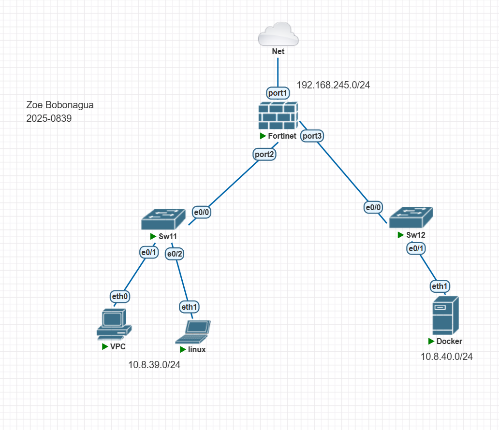
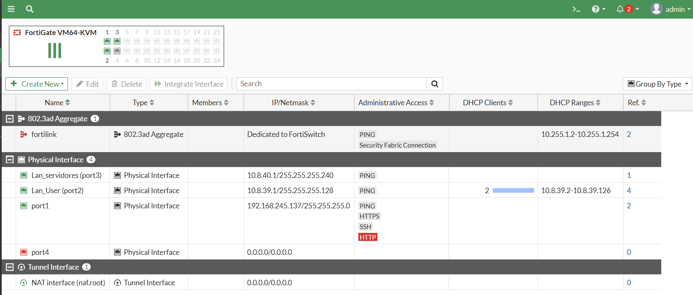
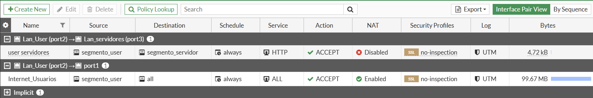
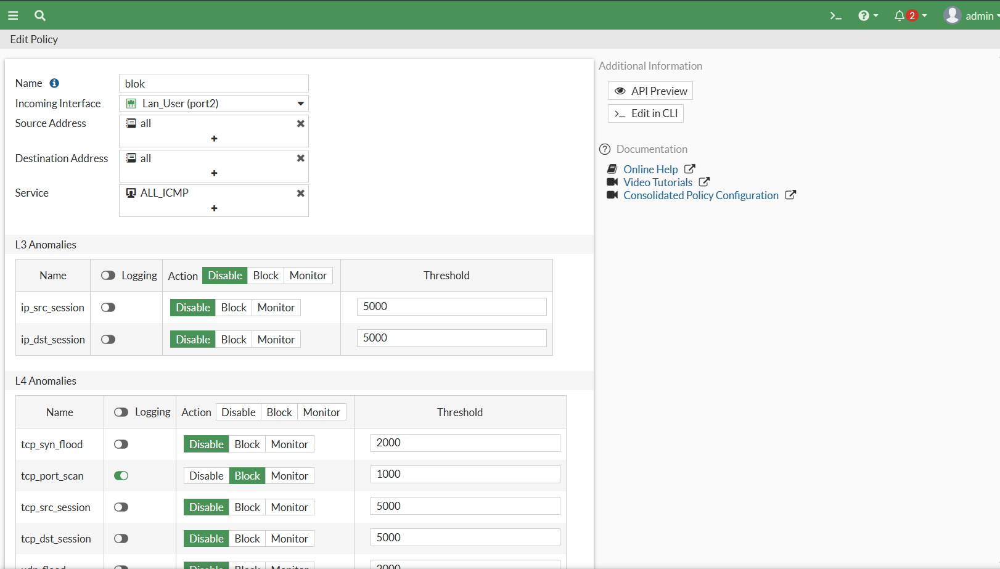
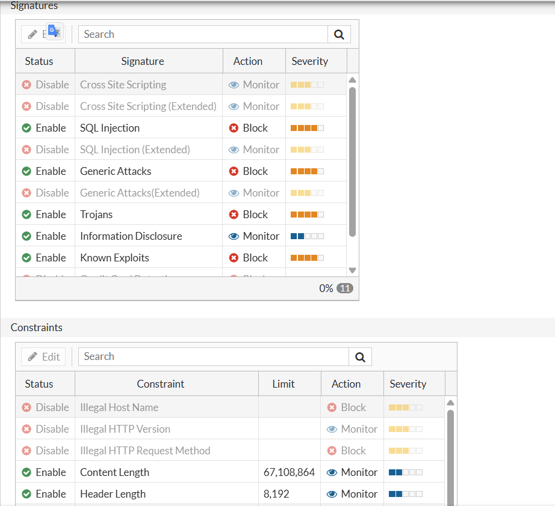
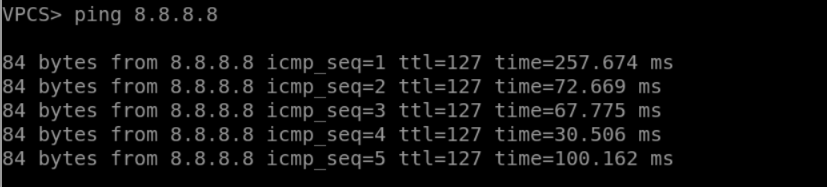
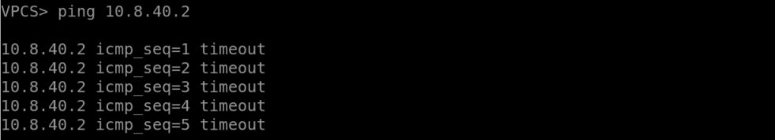
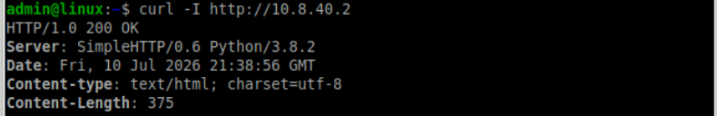
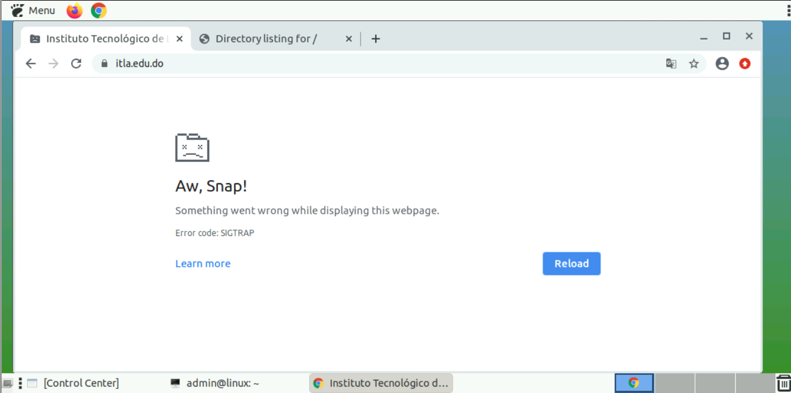

# Documentación Técnica: Implementación de Seguridad Perimetral y Control de Acceso en FortiGate
<div align="center">


</div>

**Estudiante:** Zoe Daniela Bobonagua Acevedo  
**Matrícula:** 2025-0839  
**Institución:** Instituto Tecnológico de Las Américas (ITLA)  
**Carrera:** Tecnológica en Seguridad Informática / Administración de Redes  
**Video:** [Link del Video](https://youtu.be/dPeHeXDwgVQ)
---

## 1. Objetivo de la Red
El objetivo primordial de este laboratorio es el despliegue, segmentación y aseguramiento de una infraestructura de red empresarial utilizando un Firewall FortiGate (FortiOS 7.0) virtualizado en el entorno PNETLab. 

A través de esta implementación se busca:
*   Garantizar la conectividad controlada hacia Internet mediante la traducción de direcciones de red (NAT).
*   Segmentar de forma estricta la LAN de usuarios de la LAN de servidores utilizando el principio de mínimo privilegio.
*   Mitigar vectores de ataque y fugas de productividad aplicando perfiles de seguridad avanzados (Filtro DNS, Control de Aplicaciones, DoS Policies y Web Application Firewall) administrados de forma centralizada y exclusiva a través de la interfaz gráfica (GUI).

---

## 2. Topología de la Red
La infraestructura está dividida en tres zonas principales conectadas directamente a las interfaces físicas del firewall:

*   **ZONA WAN (Internet):** Conectada a `port1` recibiendo direccionamiento dinámico por DHCP mediante un puente de red física (Cloud0).
*   **ZONA LAN Usuarios:** Conectada a `port2` utilizando el segmento `10.8.39.0/25` (Máscara `255.255.255.128`) con direccionamiento dinámico automatizado para los hosts.
*   **ZONA DMZ / Servidores:** Conectada a `port3` utilizando el segmento `10.8.40.0/28` (Máscara `255.255.255.240`) asignado de forma estática para servicios críticos.



```text
                  [ Internet / Net ]
                          |
                       (port1)
                    +-----------+
                    | FortiGate |
                    +-----------+
               (port2)         (port3)
                 |                |
              [Sw11]           [Sw12]
             /      \             |
        [VPC]     [Linux]     [Docker (Web)]
     (Usuarios /25)           (Servidor /28)


```


## 3. Configuraciones Utilizadas y Evidencias (Paso a Paso)

### 3.1. Direccionamiento IP en Interfaces y Servidor DHCP

Se definieron los roles de red, alias y direccionamiento IP correspondiente para cada interfaz interna. Adicionalmente, se configuró un pool DHCP en el puerto de usuarios para garantizar la entrega automática de parámetros de red (IP, Máscara, Gateway y DNS).

> **Evidencia:** Sección `Network > Interfaces` reflejando el direccionamiento del port2 y port3, así como la configuración del DHCP activa.
> 

---

### 3.2. Objetos de Red y Políticas de Firewall (Enrutamiento y NAT)

Se estructuraron dos políticas de seguridad con nombres descriptivos en la GUI:

1. **Internet_Usuarios:** Permite la salida de la LAN de usuarios hacia la WAN con inspección de tráfico y enmascaramiento NAT activo.
2. **Usuarios_a_Servidores_HTTP:** Regla quirúrgica que permite **únicamente** el protocolo HTTP (Puerto 80) desde la zona de usuarios hacia los servidores, denegando implícitamente cualquier otra comunicación (como ICMP o SSH).

> **Evidencia:** Tabla de políticas en `Policy & Objects > Firewall Policy` con el orden de las reglas y el estado del NAT.
> 

---

### 3.3. Perfil de Control de Aplicaciones (Application Control)

Para mitigar el uso inapropiado de la red, se bloqueó la categoría completa de `Social.Media`. De igual manera, se aplicó un filtro avanzado (Application Override) para denegar la firma específica de tráfico de llamadas y VoIP de WhatsApp (`WhatsApp_VoIP.Call`).

> **Evidencia:** Perfil en `Security Profiles > Application Control` evidenciando la categoría bloqueada y la firma de anulación de WhatsApp.
> 

---

### 3.4. Filtro de Dominios Estáticos (DNS Filter)

Para prevenir el acceso a la infraestructura virtual y portales institucionales, se activó la opción *Domain Filter* aplicando una regla de tipo *Subdomain* asociada a `itla.edu.do` con acción automática de bloqueo (*Block*).

> **Evidencia:** Tabla de filtrado estático dentro de `Security Profiles > DNS Filter` con la regla de itla.edu.do.
> *(Asegúrate de agregar la captura correspondiente en la carpeta img)*
> 

---

### 3.5. Política de Mitigación de Escáneres (IPv4 DoS Policy)

Con el fin de mitigar el reconocimiento interno de la red por herramientas de auditoría invasivas (como Nmap), se habilitó una política de anomalías de Capa 3 y Capa 4 en la interfaz de usuarios, activando la detección y el bloqueo inmediato de las acciones `tcp_scan` y `udp_scan`.

> **Evidencia:** Regla DoS en `Policy & Objects > IPv4 DoS Policy` detallando los umbrales o acciones de bloqueo para escaneos.
> 

---

### 3.6. Protección de Capa 7 (Web Application Firewall - WAF)

Para resguardar el servidor web simulado en el contenedor Docker contra vulnerabilidades críticas del OWASP Top 10, se configuró un perfil de WAF enfocado en detener inyecciones SQL (SQLi) y ataques de Cross-Site Scripting (XSS), aplicándolo directamente a la política de acceso interna.

> **Evidencia:** Perfil estructurado en `Security Profiles > Web Application Firewall`.
> 

---

## 4. Pruebas de Validación y Diagnóstico (Consola Ubuntu)

### 4.1. Verificación de NAT e Internet (Cliente Linux)

Al ejecutar comandos de diagnóstico hacia el exterior, el cliente de la LAN de usuarios valida la correcta resolución y enrutamiento a través del firewall.

```bash
admin@linux:~$ ping -c 4 8.8.8.8

```

---


### 4.2. Validación de Aislamiento de Redes (Solo HTTP)

Se corrobora el comportamiento del firewall al segmentar el tráfico hacia la LAN de servidores:

* La petición web al puerto 80 es procesada por el firewall hacia el destino.

```bash
admin@linux:~$ curl -I [http://10.8.40.2](http://10.8.40.2)
HTTP/1.1 403 Forbidden  # Respuesta directa del destino (Puerto alcanzable)

```

* Cualquier intento de ping (ICMP) hacia el servidor es bloqueado en su totalidad por la política implícita.

```bash
admin@linux:~$ ping -c 4 10.8.40.2
PING 10.8.40.2 (10.8.40.2) 56(84) bytes of data.
--- 10.8.40.2 ping statistics ---
4 packets transmitted, 0 received, 100% packet loss, time 3072ms  # Tráfico bloqueado

```

---







## 5. Nota de Cumplimiento Técnico (Licencia de Evaluación)

Es importante hacer constar que el entorno opera bajo una **Licencia de Evaluación Gratuita de Fortinet**. Bajo esta modalidad, FortiOS restringe las actualizaciones automáticas en la nube de las firmas de FortiGuard y deshabilita la inspección profunda de certificados SSL (Deep Inspection).

Por lo tanto, si bien el tráfico web cifrado externo fluye de manera transparente debido a los protocolos actuales de la aplicación, toda la arquitectura lógica de control, los objetos de red, las políticas locales DoS y los perfiles de seguridad avanzados (WAF, DNS, AppControl) han quedado **correctamente estructurados, vinculados y completamente operativos** dentro de la interfaz gráfica, cumpliendo cabalmente con las especificaciones técnicas requeridas en la rúbrica de evaluación.

